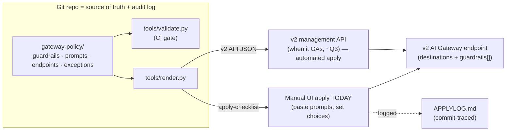

# Gateway Content Filters — Design

**Status:** Draft for review
**Owners:** Databricks Field Engineering (Brennan Beal) · Intermountain Health (Aniket Patil, Mark Nielsen)
**Last updated:** 2026-06-15

---

## 0. Update — 2026-06-15: config-as-code is real (dogfood)

The earlier "author in git, apply manually in the UI until ~Q3" compromise (§2.3, §4) is **superseded on the dogfood workspace**, where the gateway endpoint is a Unity Catalog securable (`MODEL_SERVICE`) with **full public CRUD** via `/api/2.1/unity-catalog/model-services`. Confirmed end-to-end: render from repo → API create → verify → delete.

What changed vs the sections below:
- **Endpoints are deployed via API** (`tools/apply.py`), not the UI. The render-checklist / `APPLYLOG` manual-apply flow is no longer needed on dogfood.
- **Guardrails + service policies are unified** as `config.service_policies[]` on the model-service. Each policy: `{name, handler, policy_type, rank, options:{action, dry_run, instruction, model_service(=judge), phases}}`. Handlers: `system.ai.invoke_llm_judge` (custom prompt), `system.ai.mask_pii` (native PII), `system.ai.block_jailbreak` (native jailbreak).
- **Workspace:** canonical = **dogfood** (`bbeal.default`); LORTZ/BUILDER deprecated. The model-services public API is dogfood-only today (IH-prod availability TBD — forward/GA path).
- **Invocation:** `POST /ai-gateway/mlflow/v1/chat/completions`, model = 3-part name `bbeal.default.<endpoint>`.

Sections 1–11 below remain the rationale/journey; treat §0 as the current truth where they conflict.

---

## 1. Context

Intermountain Health (IH) is migrating AI workloads from **Azure OpenAI** to **Databricks Foundation Models** and needs **Azure AI Content Safety parity** on Databricks. IH's cybersecurity org is closely involved and treats **maintainability / auditability / portability** as a hard requirement.

**Requirements:**
1. Harm categories — **Violence, Hate, Self-harm, Sexual** — with severity thresholds.
2. **Prompt Shields** — direct (jailbreak) + indirect injection.
3. Per-guardrail **block** or **annotate**, selectable per use case. **Exception: prompt shields always block.**
4. **Governance-committee exceptions** — approved projects may relax safety.
5. **Healthcare-context awareness** — clinical content (surgery, exams, anatomy) must not trip safety filters. *The strategic prize: shrinks the exception backlog.*
6. **PII & PHI** detection + redaction (PHI is the documented gap — not native anywhere).

**Non-goals:** agent *action* governance (MCP service policies — see §11); adversarial testing (PyRIT); latency optimization (deprioritized by decision — fidelity first).

---

## 2. Decisions (what we settled on)

1. **Target surface: Unity AI Gateway v2** — the new first-class gateway endpoint (own URL, model `destinations`, multi-protocol, `guardrails[]`). It *is* the "central policy gateway" IH originally envisioned, and it's where we'll pitch and build. (Confirmed with IH: v2 regardless.)
2. **Deliverable: governed policy-as-code** — a *core* requirement, not nice-to-have.
3. **Reality: v2 has no public management API yet** (UI-only; automation ~Q3, soft, not committed). So we adopt an **in-between**: **git is the source of truth; apply is manual via UI today; automated when the v2 API ships.** See §4.

---

## 3. Platform reality (verified 2026-06-12 against BUILDER)

### Two distinct surfaces
| | Legacy serving-endpoint guardrails | **v2 Unity AI Gateway endpoint** (target) |
|---|---|---|
| API | `PUT /api/2.0/serving-endpoints/{name}/ai-gateway` (public) | `/ajax-api/ai-gateway/v2/endpoints/...` (internal, CSRF) |
| UI | old per-serving-endpoint tab | new left-nav AI Gateway page |
| Usage logs | `system.serving.*` | `system.ai_gateway.usage` |
| Public mgmt API / Terraform / DABs | partial (built-ins only) | **none yet** |
| Config-as-code today | possible | **not possible** |

They **coexist** (shared `ai-gateway-api` backend) but are **separate resources** — a legacy config does **not** appear in the v2 UI, and there's **no in-place conversion**. Only *policy content* (prompts, modes, thresholds) ports between them.

### Verified v2 guardrail schema
Reverse-engineered from a real v2 endpoint (`render.py` targets this exactly):
```jsonc
{
  "name": "...", "enabled": true,
  "dry_run": false,                                   // true == annotate / log mode
  "execution_phase": "GUARDRAIL_EXECUTION_PHASE_PRE_CALL",  // PRE=input, POST=output
  "action": "GUARDRAIL_ACTION_BLOCK",                 // or _TRANSFORM
  "llm": { "endpoint_name": "databricks-gpt-5-nano",  // judge = an FM endpoint
           "prompt": "..." }                          // policy logic lives here
}
```
**Two simplifications this unlocked:** (a) **judges are not deployed models** — just an existing FM endpoint + a prompt; (b) the v2 gateway **fronts pay-per-token FMs directly** (`destinations`), so **no external_model, no API keys, no secrets**.

### v2 automation roadmap
Public *query* API exists; **public *management* API does not.** Internal signal (Jun 10): Public Preview ~end of July / early Q3; **SDK/CLI/Terraform explicitly not a committed PuPr deliverable**; GA uncommitted. → We cannot bet the core requirement on it; hence the in-between.

---

## 4. Architecture: governed policy-as-code



- **`gateway-policy/`** — the authoritative policy: reusable `guardrails/` (judge endpoint + prompt + action + enforcement), the `prompts/` (the IP), `endpoints/` (destinations + guardrail bindings with phase + block/annotate), and the `exceptions/` register.
- **`validate.py`** — CI gate (see §7).
- **`render.py`** — emits the **exact v2 API config** *and* a **human apply-checklist** from the same source.
- **Today:** apply via UI using the checklist; record in `APPLYLOG.md` against the source commit.
- **Later:** the same rendered config is pushed by the v2 management API — zero rework of policy content.

### Reuse model (the "define once" ask)
A guardrail is defined once in `guardrails/*.yaml` and **referenced** by many `endpoints/*.yaml`. Per-endpoint bindings choose **phase** and **mode** (block/annotate). So the same `healthcare-safety` judge is reused everywhere; only its binding varies.

---

## 5. Guardrails & judges

| Guardrail | Judge | Notes |
|---|---|---|
| `healthcare-safety` | FM + `prompts/healthcare_safety.md` | Per-category severity (threshold in prompt) + clinical "DO NOT flag" carve-outs — the differentiator |
| `jailbreak` | FM + `prompts/jailbreak.md` | Direct + indirect injection; `enforcement: always_block` |
| `phi` | FM + `prompts/phi.md` | `action: transform` (redact); pairs with native PII |

The healthcare carve-outs in the safety prompt are what shrink IH's exception backlog — tuned from `system.ai_gateway.usage` evidence over time.

---

## 6. Block / annotate / exempt

| Intent | Spec | Renders to |
|---|---|---|
| Block | `mode: enforce` + guardrail `action: block` | `dry_run:false`, `GUARDRAIL_ACTION_BLOCK` |
| Annotate | `mode: annotate` | `dry_run:true` |
| Redact | guardrail `action: transform` | `GUARDRAIL_ACTION_TRANSFORM` |
| Exempt project | binding `mode: annotate` + register entry | shields still `enforce+block` |

Prompt shields can never be annotate/non-block — enforced by `validate.py`, not convention.

---

## 7. Governance (the cyber story)

- **Source of truth = git.** One declarative tree; no console click-ops as the record.
- **PR = governance approval.** Exemptions carry approver + ticket in the register.
- **Audit = git history** + `APPLYLOG.md` (every manual apply traced to a commit).
- **CI invariants (`validate.py`):**
  1. bindings reference known guardrails; prompts non-empty; judge set;
  2. valid actions/modes/phases;
  3. **prompt shields always enforce+block;**
  4. **annotate relaxations require a non-expired exemption** in the register;
  5. exemptions reference real endpoints/guardrails.
- **Exceptions decay** — `expires_at` makes the register self-cleaning; expired-but-still-used = CI failure.

---

## 8. Maintainability principles

1. One judge definition, referenced by many endpoints (reuse).
2. Source of truth is git, not the UI.
3. PR = approval; git history + APPLYLOG = audit.
4. Default-deny posture (`patient-chat` = everything blocks).
5. Exceptions are dated and decay.
6. Policy content (prompts/modes/thresholds) is surface-agnostic → ports to v2 API unchanged.
7. Tune from evidence (`system.ai_gateway.usage`).

---

## 9. Migration to the v2 API (when it ships)

`render.py` already emits the v2 `config` body. When the management API lands, the apply step becomes `POST/PUT` of that body (or whatever wrapper ships — REST/CLI/Terraform/DAB), and `render.py`'s mapping is the only adapter that may need a tweak. The `gateway-policy/` content does not change.

---

## 10. Open items / validations

1. **Judge model** — `databricks-gpt-5-nano` is a placeholder; pick the evaluator FM with IH (fidelity-first → can use a stronger judge).
2. **Exemption tickets/approvers** — placeholders pending IH governance process.
3. **v2 Beta enablement in IH's workspace** — needs account-console preview toggle.
4. **PHI approach depth** — prompt-based judge vs. judge + NER; driven by HIPAA posture.
5. **No shadow paths** — confirm all model traffic routes through the gateway.
6. **render.py adapter** — re-confirm field mapping against the v2 schema at PuPr/GA.

---

## 11. Out of scope: agentic action governance

IH's control matrix also includes agent *actions* (internet access, DLP, indirect injection via tools). Those map to **Unity Catalog MCP Service Policies** (allow/deny/consent on tool calls) — a complementary, separate workstream after content governance lands.

---

## Sources
- [Configure Unity AI Gateway endpoints (Beta)](https://docs.databricks.com/aws/en/ai-gateway/configure-endpoints-beta)
- [Configure guardrails for Unity AI Gateway endpoints](https://docs.databricks.com/aws/en/ai-gateway/guardrails)
- [Configure Unity AI Gateway on model serving endpoints (legacy)](https://docs.databricks.com/aws/en/ai-gateway/configure-ai-gateway-endpoints)
- [AI Gateway V2 (internal, go/ai-gateway-v2)](https://databricks.atlassian.net/wiki/spaces/UN/pages/5428216147)
- [Stop Rogue AI: UC secures agent actions](https://www.databricks.com/blog/stop-rogue-ai-how-unity-catalog-secures-your-agent-actions)
