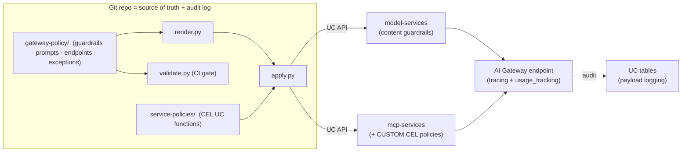
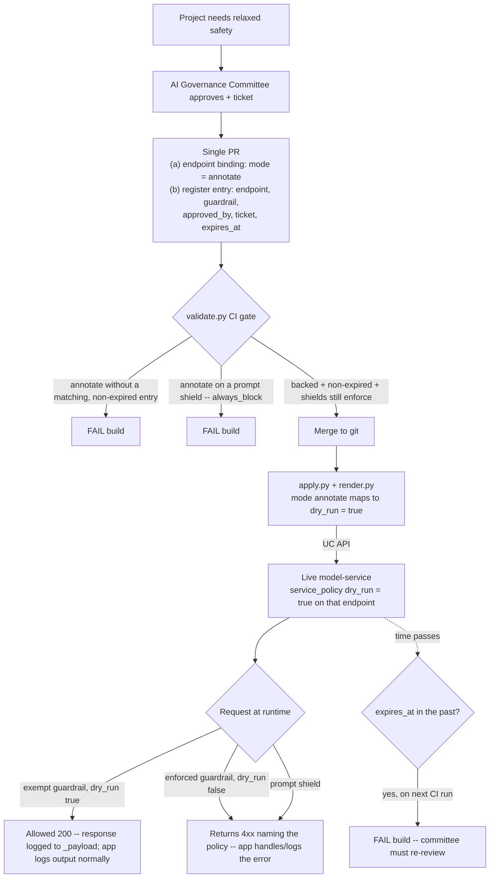

# Gateway Content Filters — Design

**Status:** Draft for review
**Owners:** Databricks Field Engineering · Customer security & MLOps
**Last updated:** 2026-06-15

---

## 1. Context

The customer is migrating AI workloads from **Azure OpenAI** to **Databricks Foundation Models** and needs **Azure AI Content Safety parity** on Databricks Unity AI Gateway. the customer's cybersecurity org treats **governed config-as-code** (versioned, reviewable, auditable, no drift) as a hard requirement.

**Requirements**
1. Harm categories — **Violence, Hate, Self-harm, Sexual** — with severity thresholds.
2. **Prompt Shields** — direct (jailbreak) + indirect injection. **Always block.**
3. Per-guardrail **block** or **annotate**, selectable per use case.
4. **Governance-committee exceptions** — approved projects may relax safety.
5. **Healthcare-context awareness** — clinical content (surgery, exams, anatomy) must not trip safety filters. *The strategic prize: shrinks the exception backlog.*
6. **PII & PHI** detection + redaction.
7. **Agent action governance** — limit what agents can *do* via MCP tools (network egress, destructive ops, data exfiltration). *(the security team's defense-in-depth emphasis)*

**Non-goals:** adversarial red-teaming framework (PyRIT — separate testing workstream); latency optimization (deprioritized — fidelity first); Microsoft 365 Copilot DLP (a CASB/Purview control, not Databricks — see §8).

---

## 2. Solution at a glance

Everything is **config-as-code in this repo, applied to the target workspace via the Unity Catalog API** — no UI. Defense-in-depth in three layers:

| Layer | What | UC resource | Repo |
|---|---|---|---|
| **Content guardrails** (what's *said*) | harm/PHI/PII/jailbreak on prompts & responses | `model-services` | `gateway-policy/` |
| **Agent action policies** (what's *done*) | allow/deny/ask on MCP tool calls | `mcp-services` + UC functions | `service-policies/` |
| **Testing & evaluation** | corpus + adversarial behavior tests | — | `tests/`, `tools/` |

Both gateway resources are **Unity Catalog securables** with full public CRUD via `/api/2.1/unity-catalog/...`, confirmed end-to-end on the target workspace (render from repo → API create → verify → delete).

> **Workspace:** canonical = **the target workspace** (`<workspace-host>`, storage `main.default`). The model-services/mcp-services public API is **the target workspace-only today**; on workspaces without it, fall back to UI config or wait for GA (the repo's `render.py` output still drives a manual apply). customer-prod availability is an open item (§9).

---

## 3. Architecture



`apply.py` performs CRUD against the UC API; `validate.py` gates every change in CI; `render.py` turns a repo endpoint spec into the exact API body. Git history + each securable's `update_time`/`updated_by` + payload logging are the audit trail.

---

## 4. Content guardrails (`model-services`)

A model-service is a UC securable. Its `config` holds **`service_policies[]`** (guardrails + service policies unified), `tracing`, `usage_tracking`. Each policy:

```jsonc
{ "name": "...", "handler": "...", "policy_type": "POLICY_TYPE_BUILTIN", "rank": 1,
  "options": { "action": "block|transform", "dry_run": "false",
               "instruction": "<prompt, custom only>",
               "model_service": "model-services/system.ai.gpt-5-2",   // the judge
               "phases": "pre_call,post_call" } }
```

| Guardrail | type → handler | Notes |
|---|---|---|
| `healthcare-safety` | custom → `system.ai.invoke_llm_judge` | per-category severity + clinical "DO NOT flag" carve-outs (the differentiator); `action: block` |
| `phi` | custom → `system.ai.invoke_llm_judge` | `action: transform` (redact); no native PHI handler |
| `jailbreak` | native → `system.ai.block_jailbreak` | direct + indirect; `always_block` |
| `pii` | native → `system.ai.mask_pii` | native redaction |

- **Judge = an FM model-service** (`system.ai.gpt-5-2`); no model to deploy, healthcare logic lives in the prompt. Endpoints front pay-per-token FMs directly — no keys/secrets.
- **Block vs annotate** = per-binding `mode` → `dry_run` (`true`=annotate/log). **Input/output** = `phases` (`pre_call`/`post_call`).
- **Reuse:** a guardrail is defined once in `guardrails/*.yaml` and referenced by many `endpoints/*.yaml`; only the binding (phase/mode) varies.
- **Deploy/invoke:** `POST /api/2.1/unity-catalog/model-services?parent=schemas/<cat>.<schema>&model_service_id=<id>`; invoke at `POST /ai-gateway/mlflow/v1/chat/completions` with model = 3-part name.

---

## 5. Agent action governance (`mcp-services`)

An MCP service is a UC securable fronting a UC HTTP connection to an MCP server. **Service policies are UC functions (CEL-transpilable)** attached to it, evaluated **before every tool call** (ALLOW/DENY/ASK).

```sql
-- contract: (event, config) -> VARIANT; access event:context.tool.name; static reason
CREATE OR REPLACE FUNCTION <cat>.<schema>.no_destructive_ops(event VARIANT, config VARIANT)
RETURNS VARIANT LANGUAGE SQL
RETURN CASE WHEN event:type::string='request'
  AND event:context.tool.name::string IN ('push_files','merge_pull_request','delete_file', ...)
  THEN to_variant_object(named_struct('result','DENY','reason','...'))
  ELSE to_variant_object(named_struct('result','ALLOW','reason','')) END;
```

```bash
# create the MCP service, then attach the policy (rank-ordered)
POST  /api/2.1/unity-catalog/mcp-services?parent=schemas/<cat>.<schema>&mcp_service_id=<id>
        {"config":{"connection":{"name":"connections/<cat>.<schema>.<conn>"}}}
PATCH /api/2.1/unity-catalog/mcp-services/<fqn>?update_mask=config.service_policies
        {"config":{"service_policies":[{"name","policy_type":"POLICY_TYPE_CUSTOM",
          "handler":"functions/<cat>.<schema>.<fn>","rank":1}]}}
```

Policies in `service-policies/`: `no_destructive_ops`, `no_egress_tools` (#13 network / #15 DLP), `no_unsafe_code_exec` (e.g. `python_exec`). Verified on the target workspace: `github_mcp` created + `no_destructive_ops` attached; unit-test `merge_pull_request`→DENY, `list_issues`→ALLOW.

---

## 6. Governance & maintainability (the cyber story)

- **Source of truth = git**, applied by API — no console click-ops as the record of truth.
- **PR = governance approval.** Exemptions carry approver + ticket + expiry in `exceptions/register.yaml`.
- **Guardrail decisions are returned in-band.** A block comes back as a descriptive **`4xx` that names the policy** (`blocked by input policy 'healthcare-safety'`); the calling app handles/logs it with its normal error handling. The gateway does **not** persist a per-guardrail verdict, and it's not its job to log a request that never reached the model.
- **Audit, independent of the apps:** git history + securable `update_time`/`updated_by`; **`system.ai_gateway.usage`** = central per-call **status ledger** (block `4xx` vs allow `200` vs error `5xx`, with requester/endpoint/timing) so governance can count/trace blocks without trusting each app; **`<name>_payload`** inference table = full request/response for **allowed** traffic (e.g. inspect redaction output). Annotate calls return `200` and are logged like any other allowed call.
- **CI invariants (`validate.py`):** refs resolve; custom guardrails have prompt+action, native don't; valid modes/phases; **prompt shields always enforce**; **annotate relaxations require a non-expired exemption**; exemptions reference real objects.
- **Default-deny** (`patient-chat` blocks everything); **exceptions decay** (expired-but-used = CI failure).
- **Reuse + portability:** one judge/prompt referenced everywhere; the same repo applies to any workspace with the API (or via UI fallback elsewhere).

### Exception flow (what triggers what)

A relaxation is only ever *applied* via the endpoint binding (`mode: annotate` → `dry_run:true`). The register entry is the **approval record + the CI gate that lets that binding exist** — and the `expires_at` is the only thing git-history alone can't enforce.



---

## 7. Testing & evaluation

- `tests/corpus.yaml` — anchor cases (clinical-allow, harm-block, jailbreak-block, PHI-redact).
- `tools/test_guardrails.py` — fires the corpus at a live endpoint; classifies **blocked / allowed / eval_error** (infra) distinctly.
- `tools/measure.py` — N-rep false-positive/false-negative/flakiness per guardrail, to pick judge models with data.
- Future (WS2c/d): PyRIT-driven adversarial generation + Agent Evaluation on production samples from payload logs.

---

## 8. Defense-in-depth: full-suite coverage

the customer's 18-item control matrix collapses into the three layers, with one honest carve-out:

| Layer | Covers (tracker items) |
|---|---|
| Content guardrails (model-services) | 1–4 harm cats, 5/6/9/10 prompt shields, 7 modes, 8 exceptions, 11 severity, 12 PII/PHI, 14 in/out filtering, 17 (runtime) |
| Agent action policies (mcp-services) | 13 internet/network (egress tools), 15 DLP (tool-side), "limit agent actions" |
| Testing & evaluation | 16 adversarial sim, 17 (offline eval), 18 PyRIT |
| **Out of scope (carve-out)** | **M365 Copilot DLP** — Microsoft/CASB (Zscaler/Purview), not Databricks |

---

## 9. PoC findings & productionization levers

- **Output-phase (`post_call`) policy evaluation is flaky on the target workspace Beta** — longer generations intermittently `Response evaluation failed for output policy '<name>'` (seen on `pii`, `phi`, `healthcare-safety`). Infra, not config/content. **Workaround:** demo endpoint is input-only; `patient-chat` keeps strict in+out as the target once Beta stabilizes. *Logged as product feedback.* (See `docs/poc-results.md`.)
- **Judge model** — `system.ai.gpt-5-2` (a stronger judge than the `gpt-5-nano` first tried on BUILDER, which false-positived on clinical content). Judge choice is a per-policy, version-controlled lever.
- **Public model-services/mcp-services API is the target workspace-only today** — confirm availability on the customer's workspace (gated-beta enrollment / GA timing); UI or render-driven manual apply is the fallback.
- **Open:** exemption tickets/approvers (placeholders); PHI depth (prompt-judge vs +NER per HIPAA posture); confirm no model traffic bypasses the gateway; live tool-call-through-MCP denial demo (needs U2M login + MCP-client wiring).

---

## 10. Repo layout

```
gateway-policy/  guardrails · prompts · endpoints · exceptions   (content guardrails as code)
service-policies/  CEL UC functions for MCP action governance
tools/  render.py · apply.py · validate.py · test_guardrails.py · measure.py · _policy.py
tests/corpus.yaml · docs/{design.md,poc-results.md} · .github/workflows/validate.yml
```

---

## Sources
- [Configure Unity AI Gateway endpoints (Beta)](https://docs.databricks.com/aws/en/ai-gateway/configure-endpoints-beta)
- [MCP services (preview)](https://docs.databricks.com/aws/generative-ai/agent-framework/mcp-services)
- [Create a service policy (preview)](https://docs.databricks.com/aws/data-governance/unity-catalog/service-policies/create-service-policy)
- [Moderate a model service with guardrails (preview tutorial)](https://docs.databricks.com/aws/data-governance/unity-catalog/ai-governance/moderate-tutorial)
- [Stop Rogue AI: UC secures agent actions](https://www.databricks.com/blog/stop-rogue-ai-how-unity-catalog-secures-your-agent-actions)
